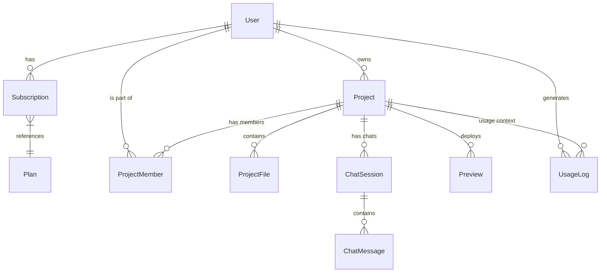

# Application Details: Lovable Clone

## Overview
This application is a "Lovable Clone," designed to be an AI-powered platform for generating, managing, and iterating on software projects. It allows users to create projects, collaborate with team members, interact with an AI to generate code, and preview the results in real-time.

## Entities and Purpose

The data model is designed to support the following core workflows:
1.  **User Management & Subscriptions**: Managing access via Plans.
2.  **Project Management**: Organizing code and collaborators.
3.  **AI Interaction**: Chatting with an AI to modify projects.
4.  **File Management**: Storing the actual code generated.
5.  **Runtime Previews**: Running the generated code.

### 1. User & Access Management
*   **`User`**: Represents a registered user of the platform.
    *   *Key Fields*: `email`, `name`, `passwordHash`, `avatarUrl`.
    *   *Purpose*: Identity and ownership.
*   **`Plan`**: Defines subscription tiers (e.g., Free, Pro).
    *   *Key Fields*: `maxProjects`, `maxTokensPerDay`, `unlimitedAi`.
    *   *Purpose*: Controls feature limits and monetization.
*   **`Subscription`**: Links a `User` to a `Plan`.
    *   *Key Fields*: `stripeCustomerId`, `stripeSubscriptionId`, `status`, `currentPeriodEnd`.
    *   *Purpose*: Tracks billing status and active plan validity.

### 2. Project Organization
*   **`Project`**: The central entity representing a codebase app.
    *   *Key Fields*: `name`, `description`, `isPublic`, `owner`.
    *   *Purpose*: Container for all files, chats, and deployments.
*   **`ProjectMember`**: Manages collaboration.
    *   *Key Fields*: `project`, `user`, `role`, `invitedAt`, `acceptedAt`.
    *   *Purpose*: Allows multiple users to work on the same project with defined permissions.
*   **`ProjectFile`**: Represents a file within the project.
    *   *Key Fields*: `path`, `minioObjectKey` (storage reference), `content` (implied or stored externally).
    *   *Purpose*: The actual source code and assets of the user's application.

### 3. AI & Chat Workflow
*   **`ChatSession`**: A conversation thread within a project.
    *   *Key Fields*: `title`, `project`, `user`.
    *   *Purpose*: Context container for specific tasks or features being built.
*   **`ChatMessage`**: Individual messages in a session.
    *   *Key Fields*: `content`, `role` (User/AI), `toolCalls` (what the AI did), `tokensUsed`.
    *   *Purpose*: The actual interaction history. `toolCalls` is crucial for tracking AI actions like "Create File" or "Run Command".

### 4. Operations & Usage
*   **`Preview`**: A runtime deployment of the project.
    *   *Key Fields*: `preViewUrl`, `status`, `podName`.
    *   *Purpose*: Allows users to verify the AI's work in a live environment.
*   **`UsageLog`**: Audit trail for resource consumption.
    *   *Key Fields*: `tokensUsed`, `action`, `durationMs`.
    *   *Purpose*: Monitoring costs and system abuse.

## Enums and Logic

Enums define restricted sets of values to ensure data integrity in logic flows.

*   **`MessageRole`**: Defines who sent a message.
    *   `USER`: The human request.
    *   `ASSISTANT`: The AI response.
    *   `SYSTEM`: High-level instructions (hidden from UI).
    *   `TOOL`: Output from a tool execution (like file reading results).
    *   *Usage*: Used in `ChatMessage` to structure the LLM context window.

*   **`ProjectRole`**: Defines permissions in a project.
    *   `EDITOR`: Can modify files and chat with AI.
    *   `VIEWER`: Read-only access.
    *   *Usage*: Checked in `ProjectMember` before allowing write operations.

*   **`SubscriptionStatus`**: Mapping of Stripe statuses.
    *   `ACTIVE`, `PAST_DUE`, `CANCELED`, `TRIALING`, etc.
    *   *Usage*: Determines if a user can create new projects or use AI features.

*   **`PreviewStatus`**: Lifecycle of a deployment.
    *   `CREATING` -> `RUNNING` -> `TERMINATED` (or `FAILED`).
    *   *Usage*: Drives the UI feedback for the "Preview" button.

## Entity Relationships & Workflow

1.  **Onboarding**: A `User` signs up and gets a default `Subscription` (likely Free tier `Plan`).
2.  **Creation**: User creates a `Project`. They become the `owner`.
3.  **Collaboration**: Owner invites another `User` as a `ProjectMember` (e.g., `EDITOR`).
4.  **Development Loop**:
    *   User starts a `ChatSession`.
    *   User sends a `ChatMessage` ("Build a login form").
    *   AI responds (`ChatMessage` with `role=ASSISTANT`) and potentially calls tools.
    *   Tool execution results (e.g., `ProjectFile` created: `login.html`) are stored and fed back as `ChatMessage` (`role=TOOL`).
5.  **Verification**: User requests a preview.
    *   System creates a `Preview` record, sets status to `CREATING`.
    *   Background process deploys code, updates status to `RUNNING`, and populates `preViewUrl`.
6.  **Tracking**: Every AI interaction logs to `UsageLog` and updates `Subscription` quotas if necessary.

## Interconnection Summary

## Important links to understand the project's table relationships

http://docs.google.com/spreadsheets/d/1Mfw1KfTvuOtGLzBC-ICE2NPvDAh0r_RL_WzPr7THRSw/edit?gid=37047342#gid=37047342